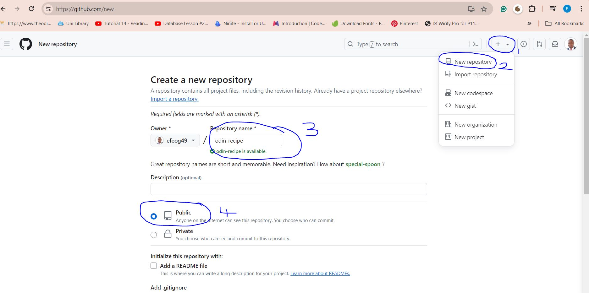
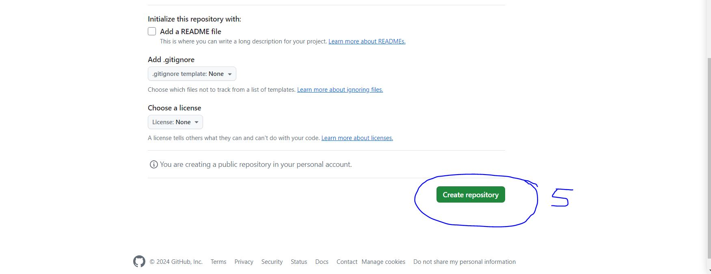
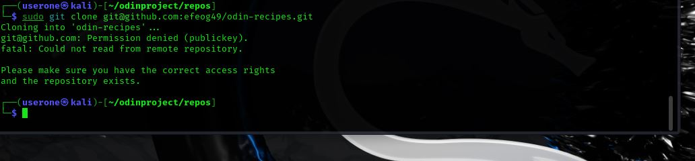
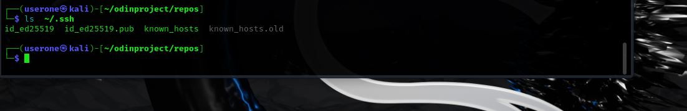
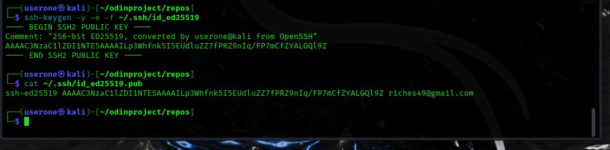

##I Am Building A Basic Recipe Website With HTML / TOP

## The Name of the website is "odin-recipes"

**CREATE/CLONE A GITHUB REPOSITORY FOR MY PROJECT**

1. I will attempt to create a private repository "odin-recipe" on github.com
   
   

 

* I clicked on the plus sign on the top right in other to create a new repository,I typed my desired repository name "odin-recipe" and it was available, I choosed a public repository,clicked on the Add a README file and then proceeded to click create repository.This worked fine without any any issues and my new repository was created.*

2. I will attempt to cloned my newly created repository on github.com "odin-recipe" onto my local computer

**when I attempted to clone my new repository, permission was denied(publickey).

